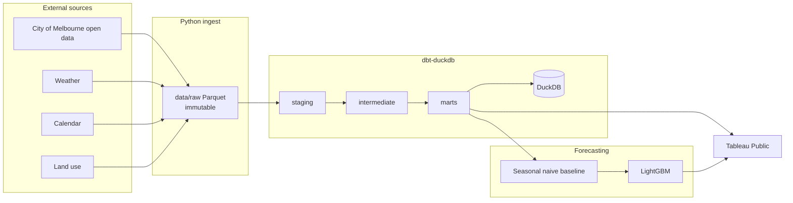

# melbourne-footfall

Forecast hourly pedestrian volume in the Melbourne CBD and measure how each
precinct recovered after COVID-19 lockdowns.

This repository is the reproducible pipeline behind that forecast: City of
Melbourne open data joined to weather, calendar, and land-use data, a baseline
then a LightGBM model, and a Tableau Public dashboard. The current checkout is
tooling and skeleton only — no extracts, no warehouse tables, no metrics.

## Problem

Pedestrian sensor counts are one of the few high-frequency public signals of
how the city is used. After lockdowns, recovery was uneven by precinct and by
hour of day. A single citywide average hides streets that returned to weekday
peaks and streets that did not.

The question this project answers:

> For each CBD precinct and hour, what footfall should we expect, and how does
> recent volume compare with a pre-lockdown baseline?

## Decision it supports

The output is meant for precinct-level operational and investment choices:
where street activation or retail support is still justified, where evening
versus lunchtime patterns have shifted, and whether a short-term dip is in
line with weather and the calendar or is an outlier.

A hiring manager can rerun the pipeline from this repo; a non-technical
stakeholder is the Tableau Public audience.

## Planned architecture



Ingest writes Parquet. dbt owns joins and grains. Python fits models only after
a seasonal-naive baseline, evaluated with MASE on a rolling-origin split.

## Quickstart

Requires Python 3.12 and [uv](https://docs.astral.sh/uv/).

```bash
uv sync
make test
make lint
```

Copy `dbt/profiles.yml.example` to `dbt/profiles.yml` before running dbt.
`dbt parse` should succeed on the empty model tree:

```bash
cp dbt/profiles.yml.example dbt/profiles.yml
uv run dbt parse --project-dir dbt --profiles-dir dbt
```

`make ingest`, `make build`, `make features`, `make train`, `make evaluate`,
and `make export` are stubs until those stages are implemented.

## Repository layout

```
howMelbMoves/
├── AGENTS.md                 # conventions for later sessions
├── config/sources.yml        # source catalogue; empty until verified
├── data/                     # raw, staged, warehouse; contents gitignored
├── dbt/                      # dbt-duckdb project
├── docs/                     # dictionary, quality notes, ADRs
├── notebooks/                # exploration only
├── src/melbourne_footfall/   # ingest, quality, features, models, export
└── tests/
```

## Data sources

Verified against live APIs on 2026-09-06. Catalogue, ids, columns, and
discrepancies are in `docs/source_verification.md` and `docs/data_dictionary.md`.
`config/sources.yml` holds the confirmed catalogue. The hourly pedestrian
table currently starts at 2024-09-06, not 2009 — see open questions in
`docs/decisions.md`.

## Results

Not yet available. This checkout has no ingestion, no models, and no scores.

## Limitations

To be documented after source verification and the first rolling-origin
evaluation. Do not treat any unpublished figure as a result.
