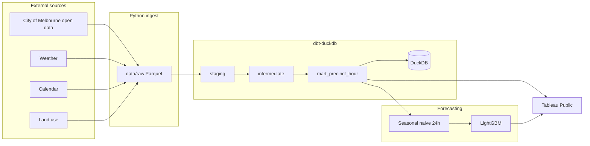

# melbourne-footfall

Forecast hourly pedestrian volume in the Melbourne CBD and compare recent
footfall to a seasonal-naive expectation, by CLUE precinct and hour.

City of Melbourne sensor counts are joined to weather, calendar, and land-use
data in dbt. Python builds features, fits a 24-hour seasonal naive baseline
then LightGBM, scores rolling-origin MASE, and exports Parquet plus CSV for
Tableau Public.

## Problem

Pedestrian sensor counts are one of the few high-frequency public signals of
how the city is used. After lockdowns, recovery was uneven by precinct and by
hour of day. A single citywide average hides streets that returned to weekday
peaks and streets that did not.

The question this project answers:

> For each CBD precinct and hour, what footfall should we expect, and how far
> is recent volume from that expectation?

A **pre-lockdown comparison** is a stated goal but is **not in the pipeline yet**
because the live hourly API starts at 2024-09-06, not 2009 (see
`docs/decisions.md`).

## What is built

| Stage | Command | Output |
| --- | --- | --- |
| Ingest | `make ingest` / `make ingest-full` | Immutable Parquet under `data/raw/` |
| Quality | (runs at end of ingest) | JSON summary on stdout |
| Warehouse | `make build` | DuckDB + dbt views/table `mart_precinct_hour` |
| Features | `make features` | `data/staged/precinct_hour_features.parquet` |
| Train | `make train` | `data/staged/precinct_hour_predictions.parquet`, `data/staged/models/lightgbm.txt` |
| Evaluate | `make evaluate` | `data/staged/metrics.json` (rolling-origin MASE) |
| Export | `make export` | `tableau_precinct_hour.parquet` and `.csv` under `data/staged/export/` |
| All ML + dbt | `make pipeline` | Runs `build` through `export` |

**dbt models:** staging (counts, sensors, weather, calendar, CLUE centroids),
`int_location_hour`, `int_sensor_block_map` (nearest block → `clue_small_area`),
`mart_precinct_hour`.

**Modelling (ADR-011):** baseline = same precinct, same hour, 24 wall-clock
hours earlier (`lag_24h`). MASE uses train-set seasonal scale per precinct.

## Architecture


```mermaid
flowchart LR
  subgraph external [External sources]
    CoM[City of Melbourne open data]
    Wx[Weather]
    Cal[Calendar]
    LU[Land use]
  end

  subgraph ingest [Python ingest]
    Raw["data/raw Parquet"]
  end

  subgraph dbtLayer [dbt-duckdb]
    Stg[staging]
    Int[intermediate]
    Marts[mart_precinct_hour]
    DB[(DuckDB)]
  end

  subgraph ml [Forecasting]
    Base[Seasonal naive 24h]
    LGBM[LightGBM]
  end

  Dash[Tableau Public]

  CoM --> Raw
  Wx --> Raw
  Cal --> Raw
  LU --> Raw
  Raw --> Stg --> Int --> Marts --> DB
  Marts --> Base --> LGBM
  Marts --> Dash
  LGBM --> Dash
```

## Quickstart

Requires Python 3.12 and [uv](https://docs.astral.sh/uv/). Run commands from the
repo root.

```bash
uv sync
make setup
make test
make lint
```

**Smoke test (two days of counts, minutes):**

```bash
make ingest
make pipeline
```

**Full pedestrian history (slow; needs network):**

```bash
make ingest-full
make pipeline
```

Optional faster full ingest (skips the 413k-row CLUE address table; block tables
still load):

```bash
uv run python -m melbourne_footfall.ingest --start 2024-09-06 --end 2026-09-05 --skip-clue-address
make pipeline
```

On Windows, if `make` is missing, run the same targets via `uv run` (see
`Makefile`) or install Make.

### After `make pipeline`

| File | Use |
| --- | --- |
| `data/staged/metrics.json` | Rolling-origin `mase_baseline`, `mase_lgbm` |
| `data/staged/export/tableau_precinct_hour.parquet` | Canonical export (Parquet) |
| `data/staged/export/tableau_precinct_hour.csv` | **Tableau Public:** Connect → Text file |
| `data/warehouse/melbourne_footfall.duckdb` | Local warehouse (gitignored) |

Copy `dbt/profiles.yml.example` to `dbt/profiles.yml` if `make setup` was not
run. Override paths with `.env` from `.env.example`.

## Tableau Public

`make export` (included in `make pipeline`) writes **both** Parquet and CSV.
Tableau Public does not open Parquet via **Text file**; use the CSV:

`data/staged/export/tableau_precinct_hour.csv`

Connect: **Text file** → select that path → comma delimiter, header row on.

Each row is **precinct × date × hour** with `pedestriancount`, `baseline_pred`,
`lgbm_pred`, weather, calendar flags, and pooled MASE columns. Build the
workbook, then **Server → Publish to Tableau Public**.

## Repository layout

```
howMelbMoves/
├── config/sources.yml        # verified source catalogue
├── data/raw|staged|warehouse # gitignored data
├── dbt/models/               # staging, intermediate, marts
├── docs/                     # dictionary, ADRs, quality notes (local)
├── src/melbourne_footfall/   # ingest, quality, features, models, export
└── tests/
```

## Data sources

Verified against live APIs on 2026-09-06. Details in `docs/source_verification.md`
and `docs/data_dictionary.md`. Hourly counts in the catalogue span
**2024-09-06 to 2026-09-05** unless the publisher extends the API.

School terms and major events come from hand-maintained CSVs in `config/` (not
live APIs).

## Results

Evaluated on a local run: **2026-06-04 to 2026-09-01** (18,901 precinct-hour
rows, 9 CLUE small areas, 89 rolling-origin folds). Metrics from
`data/staged/metrics.json`.

| Metric | Value |
| --- | --- |
| Rolling-origin MASE (24h seasonal naive baseline) | **0.98** |
| Rolling-origin MASE (LightGBM) | **0.87** |

LightGBM beats the baseline on pooled MASE over this window (lower is better).
This compares recent footfall to a **same-hour-yesterday** expectation, not to
a pre-lockdown period.

**Tableau Public:** _Add your published workbook URL here after you publish._

Export files: `data/staged/export/tableau_precinct_hour.parquet` and
`.csv` (use CSV in Tableau Public).

## What's next

1. **Publish Tableau Public** using `tableau_precinct_hour.csv` from `make pipeline`.
2. Paste the Tableau URL into **Results** above and commit the README.
3. **Pre-lockdown baseline** — only after a verified hourly series before
   2024-09-06 exists; add a dbt column or export field, do not guess.
4. **Precinct mapping** — replace nearest-block assignment (ADR-010) if CoM
   publishes a sensor → area table.
5. **Calendar CSVs** — confirm school terms and events against official sources.
6. **Push** `main` to `origin` when the dashboard link is in the README.

## Limitations

- Precinct labels come from nearest 2024 CLUE block centroids, not a publisher join key.
- Pre-lockdown recovery is out of scope until historical hourly data is verified.
- See `docs/decisions.md` and `docs/data_quality_notes.md` for open questions.
